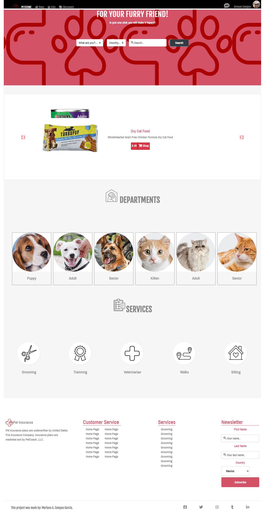

# HTML-CSS-Capstone-Project
This is my HTML & CSS capstone project, the project aims to customize a website based on  [this]( https://www.behance.net/gallery/24796463/ZATTIX) page designed by Mohammed Awad. I picked a pet store as a theme. The main page is the landing page and you can navigate to the result page by clicking on any Department link or service.

I created this project in the Workarea branch.

## Built With

HTML5
CSS
bootstrap

## [Live Link](https://rawcdn.githack.com/atenaiis/HTML-CSS-Capstone-Project/0c7f4277342f0ea16b1f832ebf66ad870f2545f2/main-page.HTML)

## Authors

👤 **Author1**

- Github: @atenaiis
- Twitter: @spranomarian

## Show your support

Give a ⭐️ if you like this project!

## Acknowledgments

Thanks to Team 123 Ocicats 